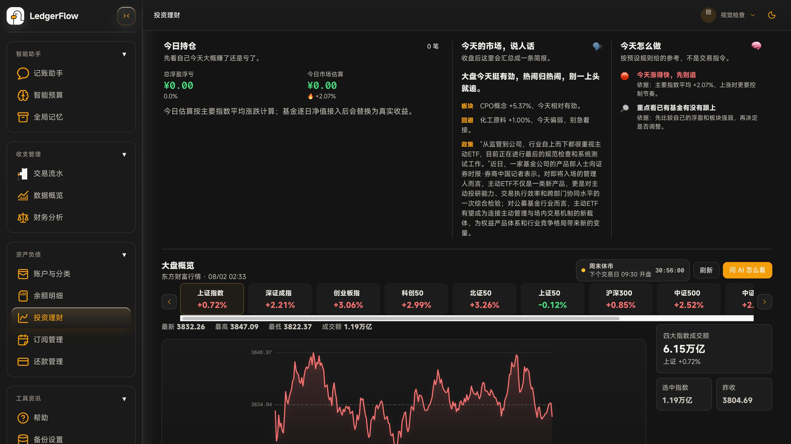
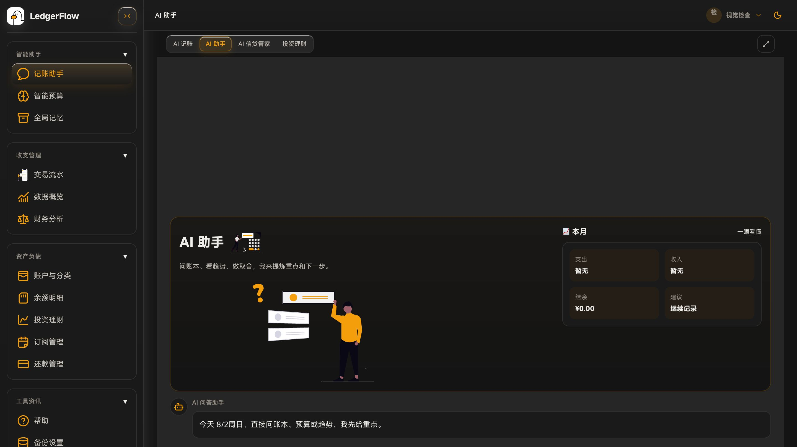
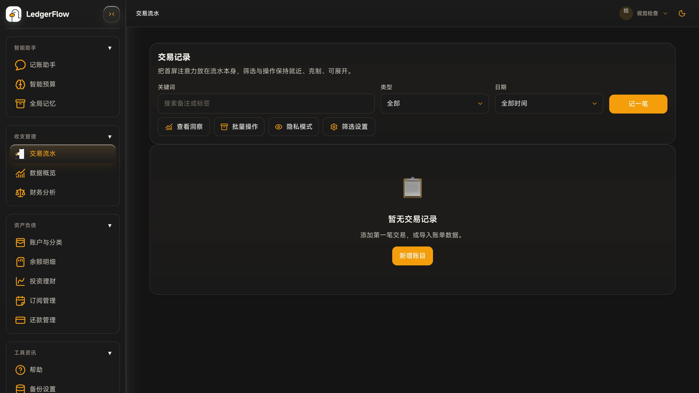
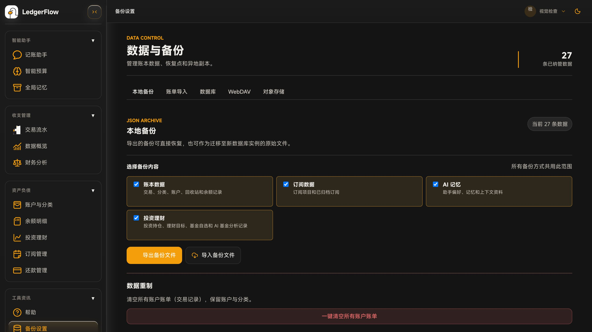

# LedgerFlow

> 面向个人长期财务管理的 AI-native 财务工作台。快速记一笔、看懂现金流、管理负债与预算，并让 AI 参与账单识别、信贷整理、投资分析和财务复盘。

LedgerFlow 当前版本：`0.6.4`

在线体验：<https://ledgerflow.shuaihong.fun>

> 说明：项目仍处于快速迭代阶段，功能、界面和数据结构会持续调整。重要数据请务必保留本地 JSON / WebDAV / OSS / MySQL 快照等备份。

## 功能页面截图

<table>
  <tr>
    <th width="50%">投资理财工作台</th>
    <th width="50%">AI 财务助手</th>
  </tr>
  <tr>
    <td></td>
    <td></td>
  </tr>
  <tr>
    <td>把今日持仓、行情播报、操作规则、多指数走势和投资资讯放在同一张工作台。</td>
    <td>在记账、财务问答、信贷和投资模式间切换，结合账本与联网资料生成可追溯回答。</td>
  </tr>
  <tr>
    <th>交易流水管理</th>
    <th>数据库与备份</th>
  </tr>
  <tr>
    <td></td>
    <td></td>
  </tr>
  <tr>
    <td>搜索、筛选、批量操作、隐私模式和新增账目集中在同一个工作区。</td>
    <td>统一管理 JSON、账单导入、SQLite / MySQL、WebDAV 与对象存储备份。</td>
  </tr>
</table>

### 0.6.4 功能亮点

- 大盘全球市场时间轴增加随当前时间每秒移动的红色竖线，周末休市时自动隐藏。

### 0.6.3 功能亮点

- 首次初始化可选择 SQLite 或 MySQL；初始化后 SQL 是业务数据源，本地缓存用于快速启动和离线恢复。
- 账号、密码和登录会话由服务端管理，账号设置可查看当前设备并退出其他会话。
- 投资理财页整合持仓收益、大白话行情、规则建议、多指数分时走势、基金自选和持仓资料。
- 投资 AI 可通过 Tavily 同时核验同花顺与雪球，单一来源失败时自动使用另一来源，并展示引用与过程状态。
- JSON、WebDAV、阿里云 OSS、S3 兼容存储和数据库快照均支持按范围备份；恢复内容会写回当前 SQL 数据库。

## 产品定位

LedgerFlow 的目标不是做一个传统流水表，而是做一个更适合年轻用户日常使用的个人财务工作台：

- 记账要快：手动录入、账单导入、AI 识别都能进入同一套交易数据。
- 信息要少而准：默认展示关键结论，详情按需展开。
- AI 要能真正介入：不仅聊天，还能识别账单、整理负债、分析基金、生成复盘建议。
- 数据要可控：SQLite / MySQL 作为主存储，JSON、WebDAV、对象存储和数据库快照用于迁移与灾难恢复。
- 结果要能追溯：交易、还款、附件、导入来源和备份版本尽量保留上下文。

## 主要能力

### 记账与数据概览

- 收入、支出、转账、还款、调整等流水管理。
- 微信 / 支付宝账单导入，支持重复处理与导入来源标记。
- 分类、账户、标签、余额变动和回收站管理。
- Dashboard 展示本月结余、净资产、趋势、分类结构、异常提醒和可排序模块。

### AI 助手

- AI 记账：从自然语言、截图、账单文本中提炼结构化交易。
- AI 问答：基于当前账本上下文做财务分析、趋势解释和行动建议。
- AI 信贷管家：识别花呗、信用卡分期、消费贷、贷款账单，并可带去还款管理。
- 支持 OpenAI-compatible 接口、自定义 Base URL / API Key / Model。
- 支持 Tavily 联网检索；投资模式优先交叉核验同花顺与雪球资讯、公告和政策。
- 支持全局记忆：长期偏好可沉淀、查看、启用/停用和管理。

### 账号与数据

- 首次启动选择 SQLite 或 MySQL，选择结果写入持久化目录并锁定，避免运行中误切数据库。
- 注册、登录、资料修改、密码更新和会话撤销均由服务端处理。
- 账号设置展示当前及其他登录设备，可单独退出设备或一键退出其他会话。
- 业务数据按账号隔离；首次升级会导入旧浏览器数据，之后以 SQL 为准。

### 预算、负债与分析

- Smart Budget：预算方案、分类预算追踪、超预算提醒。
- Repayment Management：负债清单、还款计划、实际还款记录、信贷识别预填。
- Financial Analysis：围绕过去 / 现在 / 未来生成财务分析与下一步行动。
- 订阅管理、汇率工具、工资工具等辅助页面。

### 投资理财

- 多指数行情、分时坐标提示、市场快讯、热门题材和行业板块。
- 投资持仓、自选基金、持仓流水和基金资料一键刷新。
- AI 基金分析与基金持仓分析，可沉淀加仓、减仓或继续观察建议。
- 自选基金可沉淀历史业绩、资产分布、行业分布、重仓股票、费率、基金公司等信息。
- 投资 AI 聊天支持图片、联网核验开关、可折叠检索过程、资讯引用、停止请求、复制 / 重试 / 删除等消息操作。

### 备份与同步

- 本地 JSON 导出 / 导入。
- WebDAV 备份与恢复，支持版本列表。
- 阿里云 OSS / S3 兼容对象存储备份。
- 数据库快照同步：把完整备份快照写入当前 SQLite / MySQL，恢复前校验 checksum。
- 所有备份方式都支持选择账本、订阅、AI 记忆和投资理财数据范围。
- JSON、WebDAV 和对象存储恢复统一经过关系型仓库事务，不会只停留在浏览器缓存。
- 生产镜像内置 Nginx + Node API，`/api/*` 走同容器内部 API。

## 快速部署

推荐使用 Docker Compose。当前镜像是一体化部署：Nginx 提供前端，Node API 负责数据库、账号、快照、连接检查和受保护的 WebDAV 同源代理。首次打开会先选择 SQLite 或 MySQL，然后创建首个账号。

```yaml
services:
  ledgerflow:
    image: 34v0wphix/ledgerflow:latest
    container_name: ledgerflow
    ports:
      - '18080:80'
    environment:
      # auto 允许首次打开时选择 SQLite 或 MySQL；也可固定为 sqlite / mysql。
      DATABASE_PROVIDER: '${DATABASE_PROVIDER:-auto}'
      LEDGERFLOW_DATA_DIR: '/app/data'
      SQLITE_PATH: '/app/data/ledgerflow.sqlite'
      LEDGERFLOW_API_PORT: '8787'
      LEDGERFLOW_MAX_BODY_BYTES: '52428800'
      LEDGERFLOW_MIGRATION_LOCK_TIMEOUT_SECONDS: '30'
      # first-user 仅开放首个账号注册；可改为 open 或 closed。
      LEDGERFLOW_REGISTRATION_MODE: '${LEDGERFLOW_REGISTRATION_MODE:-first-user}'
      LEDGERFLOW_SESSION_DAYS: '${LEDGERFLOW_SESSION_DAYS:-30}'
      # 当前示例通过 HTTP 直连；HTTPS 反向代理部署请设为 true。
      LEDGERFLOW_COOKIE_SECURE: '${LEDGERFLOW_COOKIE_SECURE:-false}'
      LEDGERFLOW_CORS_ORIGIN: '${LEDGERFLOW_CORS_ORIGIN:-}'
      LEDGERFLOW_API_TOKEN: '${LEDGERFLOW_API_TOKEN:?Set LEDGERFLOW_API_TOKEN to a long random value}'
      LEDGERFLOW_WEBDAV_ALLOWED_HOSTS: '${LEDGERFLOW_WEBDAV_ALLOWED_HOSTS:-}'
      MYSQL_HOST: '${MYSQL_HOST:-}'
      MYSQL_PORT: '${MYSQL_PORT:-3306}'
      MYSQL_USER: '${MYSQL_USER:-ledgerflow}'
      MYSQL_PASSWORD: '${MYSQL_PASSWORD:-}'
      MYSQL_DATABASE: '${MYSQL_DATABASE:-ledgerflow}'
      MYSQL_SSL: '${MYSQL_SSL:-false}'
    volumes:
      - ./data:/app/data
    restart: unless-stopped
```

启动：

```bash
docker compose up -d
```

升级：

```bash
docker compose pull
docker compose up -d
```

访问：

```text
http://localhost:18080
```

不配置 MySQL 时保持 `DATABASE_PROVIDER=auto`，首次打开选择 SQLite 即可。`/app/data` 必须使用
持久卷：本地 Compose 已映射到 `./data`；Railway 源码部署需要在服务设置中单独创建 Volume，挂载
路径填写 `/app/data`。否则重新部署后 provider 锁、SQLite 账本和账号都会丢失。

### Railway 最简部署

直接从 GitHub 部署本仓库即可，不需要单独部署前端或 API 服务：

1. 在 Railway 服务中新增 Volume，挂载路径填写 `/app/data`。
2. 只设置 `LEDGERFLOW_API_TOKEN`；使用 SQLite 时不需要填写 MySQL 变量。
3. 不需要单独设置 API 端口，Railway 自动注入的 `PORT` 会由 Nginx 接管；即使服务仍配置为目标端口 `80` 也兼容。
4. 首次打开页面选择 SQLite，之后创建账号即可。

容器内部 API 固定使用 `8787`，公网请求统一由 Nginx 转发到 Railway 提供的服务端口。Railway 的
`PORT` 不会覆盖内部 API 端口，也不需要手动设置 `LEDGERFLOW_API_PORT`。

## 必填与可选环境变量

### 必填

`LEDGERFLOW_API_TOKEN`

用于保护 MySQL 快照 API 和 WebDAV 同源代理。请使用足够长的随机字符串，并在页面里的 MySQL 快照令牌 / WebDAV 代理令牌输入同一个值。

### MySQL 快照

```env
MYSQL_HOST=rm-xxxx.mysql.rds.aliyuncs.com
MYSQL_PORT=3306
MYSQL_USER=ledgerflow
MYSQL_PASSWORD=CHANGE_ME
MYSQL_DATABASE=ledgerflow
MYSQL_SSL=false
```

选择 SQLite 或 MySQL provider 后，关系表就是业务数据源；快照继续用于导出和灾难恢复。Provider 规则、关系模型和旧数据迁移顺序详见 [docs/database-architecture.md](docs/database-architecture.md)，账号与会话见 [docs/account-service.md](docs/account-service.md)，MySQL 快照见 [docs/mysql-snapshot-sync.md](docs/mysql-snapshot-sync.md)。

### 账号服务

```env
LEDGERFLOW_REGISTRATION_MODE=first-user
LEDGERFLOW_SESSION_DAYS=30
LEDGERFLOW_COOKIE_SECURE=true
LEDGERFLOW_CORS_ORIGIN=
```

同源部署不需要填写 `LEDGERFLOW_CORS_ORIGIN`。完整说明见 [docs/account-service.md](docs/account-service.md)。

### WebDAV 代理白名单

```env
LEDGERFLOW_WEBDAV_ALLOWED_HOSTS=dav.example.com
```

可选但推荐。填写后，WebDAV 同源代理只允许访问这些域名。多个域名用英文逗号分隔。

如果不填写，服务端仍会强制：

- 只允许 HTTPS 上游。
- 拒绝 localhost / 内网 / 链路本地 / 保留网段。
- 请求必须带 `X-LedgerFlow-Api-Token`。

## 本地开发

要求：

- Node.js 20+
- npm 10+

安装依赖：

```bash
npm install
```

启动前端：

```bash
npm run dev
```

如果需要本地测试 MySQL 快照 API：

```bash
LEDGERFLOW_API_TOKEN=replace-with-a-long-random-token \
MYSQL_HOST=127.0.0.1 \
MYSQL_PORT=3306 \
MYSQL_USER=ledgerflow \
MYSQL_PASSWORD=change-me \
MYSQL_DATABASE=ledgerflow \
npm run server:mysql
```

常用命令：

```bash
npm run test
npm run build
npm run lint
```

## 安全说明

- LedgerFlow 是个人财务工具，请不要把测试令牌、AI Key、MySQL 密码提交到仓库。
- `LEDGERFLOW_API_TOKEN` 不是用户密码，而是保护快照与 WebDAV 代理等基础设施接口的服务令牌。
- WebDAV 同源代理已做服务端鉴权和公网 HTTPS 校验，但仍建议配置 `LEDGERFLOW_WEBDAV_ALLOWED_HOSTS`。
- OpenAI、Tavily 和 Embedding 密钥保存在当前浏览器设置中，不会写入 SQL；请不要在共享设备上保持密钥明文可见。
- AI 结果只作为辅助分析，涉及投资、借贷、还款等决策时请自行核对来源和数字。
- 初始化完成后 SQL 是业务数据源，LocalStorage 只作为快速启动和离线恢复缓存；仍请定期保留异地备份。

## 项目结构

```text
src/
  app/                 应用入口、路由、全局样式
  pages/               页面级模块
  features/            业务功能组件与模型
  shared/              共享 API、状态、工具与 UI
server/                内置 Node API
docker/                容器启动脚本
docs/                  部署与同步文档
plans/                 版本计划与主线任务
release-notes/         历史版本说明
```

## License

This repository is released under **CC BY-NC-SA 4.0**.

See:

- [LICENSE](LICENSE)
- [LICENSES/CC-BY-NC-SA-4.0.md](LICENSES/CC-BY-NC-SA-4.0.md)
