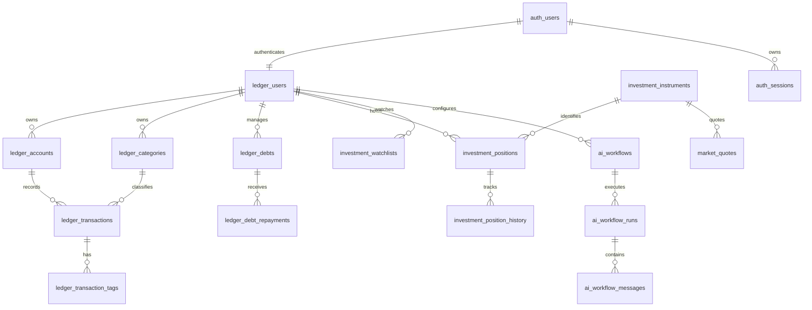

# Database architecture

LedgerFlow is moving from browser-owned JSON state to a server-owned relational data model.
The database is the source of truth for financial records, credit, investments, market context,
and AI workflow history. JSON backups remain an import/export and disaster-recovery format only.

## Supported providers

| Deployment | Provider | Intended use |
| --- | --- | --- |
| Single machine or private container | SQLite | Low-maintenance, single-instance deployment with a persistent volume |
| Production, multiple devices, or managed cloud | MySQL 5.7.8+ | Aliyun RDS and other managed MySQL services |

The first initialization writes `database-provider.json` to `LEDGERFLOW_DATA_DIR`. The provider
is immutable for that deployment. Changing it requires export, a new deployment, and import.

## Schema migration

`server/relationalDatabase.js` owns schema migrations. Each migration has a monotonic numeric
version stored in `ledger_schema_migrations`. V1 creates the ledger tables; V2 adds the account,
session, password-reset placeholder, audit-log placeholder and performance indexes. Existing V1
deployments run V2 only. SQLite serializes migration work with `BEGIN IMMEDIATE`; MySQL uses a
named `GET_LOCK` before applying pending migrations.

1. A new deployment validates the selected provider.
2. The migration runner creates the schema and the legacy `default` ledger row.
3. The provider lock is written only after validation and schema setup succeed.
4. Every initialized service checks migrations through `GET /api/setup/status`.

Migrations must be forward-only and idempotent. They must work on both SQLite and MySQL; do not
use MySQL-only JSON columns, `ALTER COLUMN`, or provider-specific generated IDs. LedgerFlow creates
string IDs in the application so rows can retain their identity during import and provider migration.

## Domain model

The schema is grouped by ownership rather than by pages:

- Ledger: users, settings, accounts, categories, transactions, tags, attachments, balance changes,
  and subscriptions.
- Credit: debts and repayment records, with optional links to accounts and transactions.
- Investment: instruments, positions, position history, goals, watchlists, and persistent analysis
  results.
- Market intelligence: quote snapshots, news, and generated news summaries.
- AI: reusable workflows, runs, messages, and references to the business records used as context.

Amounts use `DECIMAL(20, 6)` in MySQL and numeric storage in SQLite. Timestamps are UTC ISO strings
at the application boundary. IDs and all foreign keys use bounded strings so MySQL 5.7 indexes and
foreign keys remain valid under `utf8mb4`.

## JSON policy

Business fields must remain queryable relational columns. Examples: transaction amount, account,
category, debt balance, instrument code, quote price, workflow status, and timestamps.

JSON text is permitted only for variable supplier or model payloads that are not stable business
contracts: raw quote and news provider responses; AI analysis payloads, model usage, and attachment
descriptors; workflow settings and captured context snapshots. These fields are bounded by API
request limits and are never the only copy of a core record.

## Migration from legacy browser data

1. Export the existing JSON backup before upgrading.
2. Import accounts and categories first, preserving IDs.
3. Import transactions, tags, attachments, subscriptions, and balance-change history in a database
   transaction.
4. Import debts and repayment records.
5. Import investment positions, history, goals, watchlists, and saved AI conversations.
6. Write a migration report with inserted, skipped, and rejected records. No source backup is
   deleted automatically.

## Runtime repository contract

`server/relationalDataRepository.js` is the persistence boundary for the authenticated
multi-account application. It supports SQLite and MySQL with the same business payload and has no
browser storage dependency. The authenticated ledger user ID is passed into every repository read,
write and count operation.

- `GET /api/data/bootstrap` reads the relational rows and reconstructs the application state.
- `PUT /api/data/import` replaces a user's data in one database transaction. It writes accounts,
  categories, transactions, tags, attachments, balance changes, subscriptions, debts, repayments,
  positions, position history, goals, and watchlists as rows.
- `GET /api/data/status` returns SQL row counts. It is the diagnostic endpoint for confirming that
  a deployment contains real relational data rather than only a snapshot.

The application blocks normal pages until it has completed this bootstrap. On a fresh initialized
database it imports the existing browser cache once; afterward SQL is authoritative. LocalStorage
remains a fast startup/offline recovery cache only. Every business-state change is debounced and
written back through the repository. Clearing local browser storage must therefore not delete a
user's ledger.

Legacy JSON, WebDAV, OSS, and snapshot restores are converted server-side through the same
transaction before the browser state is replaced. A failed SQL write leaves both the previous SQL
data and the displayed data unchanged.

### Relation tables versus extensible settings

`ledger_user_settings` is intentionally not a replacement for business tables. It currently holds
only flexible settings with no stable query contract: RSS subscriptions, AI chat transcript UI
payloads, global memories, category-learning hints, and the variable detail arrays on a fund
watchlist. The watchlist's searchable identity, current recommendation, risk, timestamps, tags,
and holding amount remain normalized columns. New queryable domain fields must get a migration and
a column/table rather than being appended to a settings JSON document.

AI workflow definitions, runs, messages, market quotes, news, and summaries already have their own
schema tables. Their producer services should write those tables directly as the workflows and
market ingestion jobs are enabled; they must not be stored in browser persistence.

## Redis decision

Redis is not required for the first production database rollout. SQLite/MySQL should hold durable
business data; Redis must never be the only copy of it.

Introduce Redis only when one of these needs is measured in production:

- shared market quote cache with a short TTL across multiple API instances;
- durable asynchronous job queue for quote ingestion, news summarization, or long AI workflows;
- rate limiting and distributed locks for multi-instance writes;
- pub/sub delivery for live market panels.

Before that point, use MySQL/SQLite tables plus an in-process scheduler for a single instance. When
Redis is added, cache keys, TTLs, invalidation, job retry rules, and a no-Redis fallback must be
documented and tested.

## Production checklist

- Mount `LEDGERFLOW_DATA_DIR` as persistent storage for SQLite and provider metadata.
- Use a dedicated MySQL database, TLS, least-privilege application user, and automated backups.
- Run migrations in staging against the same MySQL major version as production.
- Verify a legacy backup import and restore before switching users to the database repository.
- Monitor migration version, connection failures, slow query time, backup freshness, and failed AI
  workflow runs.
- Keep `LEDGERFLOW_API_TOKEN` secret. It is a service-level management token, not a user password.
- Set `LEDGERFLOW_COOKIE_SECURE=true` for HTTPS deployments and configure
  `LEDGERFLOW_CORS_ORIGIN` only when the frontend is on a different origin.
- Configure a Railway/Docker persistent volume at `/app/data` for `LEDGERFLOW_DATA_DIR`.
